# airo-models
Curated URDFs and 3D models of the robots and gripper used at airo.

## Model gallery

<table>
  <tr>
    <th colspan="3" align="left">Arms</th>
  </tr>
  <tr>
    <td align="center">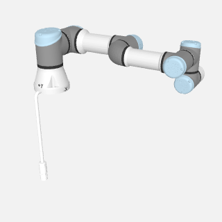<br/><code>ur3e</code></td>
    <td align="center">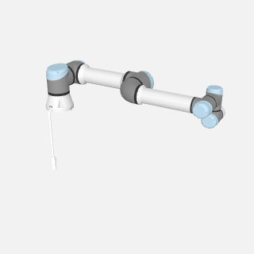<br/><code>ur5e</code></td>
    <td align="center">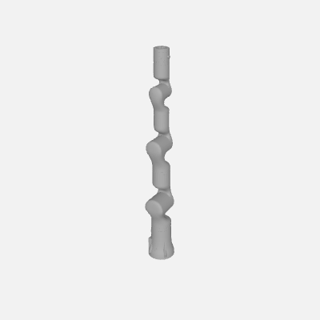<br/><code>rm75_6f</code></td>
  </tr>
  <tr>
    <th colspan="3" align="left">Grippers</th>
  </tr>
  <tr>
    <td align="center">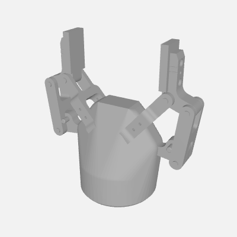<br/><code>robotiq_2f_85</code></td>
    <td align="center">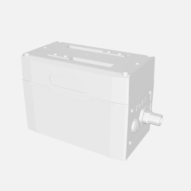<br/><code>schunk_egk40</code></td>
    <td align="center">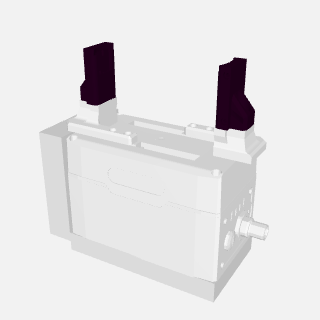<br/><code>schunk_egk40_magneto</code></td>
  </tr>
  <tr>
    <th colspan="3" align="left">Cameras</th>
  </tr>
  <tr>
    <td align="center">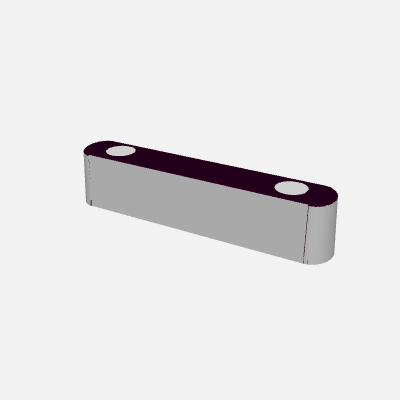<br/><code>zed2i</code></td>
    <td align="center">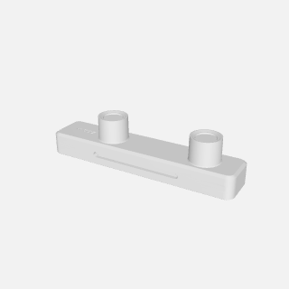<br/><code>zedm</code></td>
    <td align="center">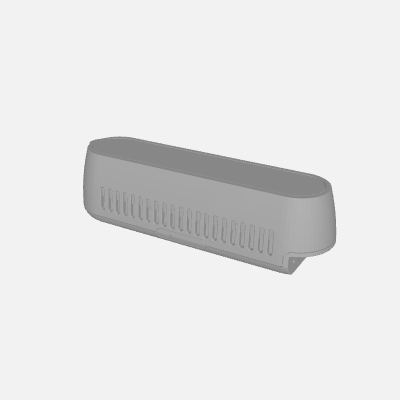<br/><code>d435</code></td>
  </tr>
  <tr>
    <th colspan="3" align="left">Mobile platforms</th>
  </tr>
  <tr>
    <td align="center">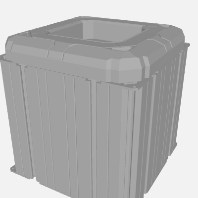<br/><code>kelo_robile_battery</code></td>
    <td align="center"><br/><code>kelo_robile_cpu</code></td>
    <td align="center">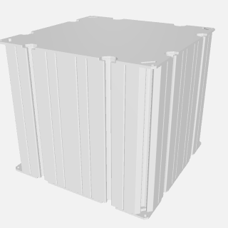<br/><code>kelo_robile_wheel</code></td>
  </tr>
  <tr>
    <th colspan="3" align="left">Environment</th>
  </tr>
  <tr>
    <td align="center">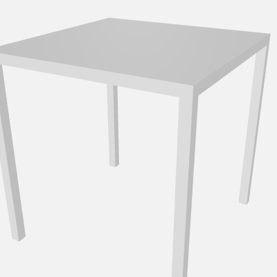<br/><code>table8080</code></td>
    <td align="center">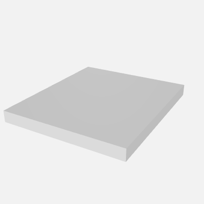<br/><code>mounting_plate_ur3e</code></td>
    <td align="center">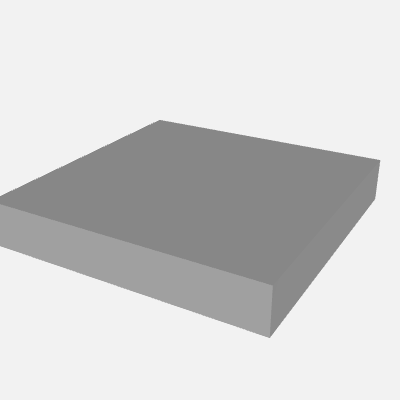<br/><code>mounting_plate_ur5e</code></td>
  </tr>
</table>

> Preview images are rendered by [`scripts/render_model_images.py`](scripts/render_model_images.py) (`pip install airo-models[render]`). Run it after adding new models to keep the gallery up to date.

## Installation
`airo-models` is available on PyPi and can be installed with pip:
```
pip install airo-models
```

## Usage
Example of loading a URDF from airo-models, customizing it and writing it to a temporary file:
```python
import airo_models

robotiq_urdf_path = airo_models.get_urdf_path("robotiq_2f_85")
robotiq_urdf = airo_models.urdf.read_urdf(robotiq_urdf_path)

# Make the robotiq gripper static
airo_models.urdf.replace_value(robotiq_urdf, "@type", "revolute", "fixed")
airo_models.urdf.delete_key(robotiq_urdf, "mimic")
airo_models.urdf.delete_key(robotiq_urdf, "transmission")

# Write it to a temporary file to read later with Drake's AddModelFromFile
robotiq_static_urdf_path = airo_models.urdf.write_urdf_to_tempfile(
    robotiq_urdf, robotiq_urdf_path, prefix="robotiq_2f_85_static_"
)
```

To check which models are available:
```python
from airo_models.files import AIRO_MODEL_NAMES

print(AIRO_MODEL_NAMES)

>>> ['ur3e', 'ur5e', 'robotiq_2f_85']
```

### Combining URDFs
Use `airo_models.urdf.attach_urdf` to merge multiple URDF models into one — for example, attaching a gripper and a wrist camera to a robot arm:
```python
import copy
import airo_models
from airo_models.urdf import attach_urdf, make_paths_absolute, read_urdf, write_urdf_to_tempfile

arm_path = airo_models.get_urdf_path("rm75_6f")
gripper_path = airo_models.get_urdf_path("robotiq_2f_85")
camera_path = airo_models.get_urdf_path("d435")

arm = read_urdf(arm_path)
make_paths_absolute(arm, arm_path)

attach_urdf(arm, copy.deepcopy(read_urdf(gripper_path)), parent_link="tool0",
            child_prefix="robotiq_", attachment_urdf_path=gripper_path,
            origin_xyz="0 0 0.02", freeze_joints=False)

attach_urdf(arm, copy.deepcopy(read_urdf(camera_path)), parent_link="tool0",
            child_prefix="d435_", attachment_urdf_path=camera_path,
            origin_xyz="0 0.05 0", origin_rpy="0.5236 0 0")

combined_path = write_urdf_to_tempfile(arm, prefix="arm_gripper_camera_")
```
See `scripts/combine_urdf_example.py` for a runnable demo that opens the result in the browser viewer.

### URDF Primitives
The `airo_models` package provides convenient functions to generate URDFs for basic geometric shapes without needing to write URDF files by hand. This is useful for creating collision geometries, obstacles, or simple models.

Supported shapes are: **box**, **sphere**, **cylinder**, and **mesh**. Each shape has four functions available for different use cases:

1. `{shape}_geometry_dict(...)` — Returns a dictionary representation of just the geometry. Use this to embed a primitive in a more complex URDF structure.
2. `{shape}_dict(...)` — Returns a dictionary representation of a complete single-link URDF model. Use this to manipulate the URDF as a dictionary (e.g., to edit properties).
3. `{shape}_urdf(...)` — Returns the URDF as an XML string. Use this to inspect or write the URDF to a file.
4. `{shape}_urdf_path(...)` — Generates and writes the URDF to a temporary file, returning the path. Use this when you need to load the URDF into a simulator or robotics library.

All shape functions accept `name` and (optionally) `rgba` parameters to customize the model name and visual color. The URDF follows the modeling convention: X+ forward, Z+ up, with the origin at the center of the shape.

#### Examples

Generate a box URDF and get the path for use with Drake or another simulator:
```python
import airo_models

# Create a red box with dimensions (0.5, 1.0, 2.0) meters
box_path = airo_models.box_urdf_path(size=(0.5, 1.0, 2.0), name="my_box", rgba=(1.0, 0.0, 0.0, 1.0))
```

Create a sphere and inspect the XML:
```python
# Create a yellow sphere with radius 0.1 meters
sphere_xml = airo_models.sphere_urdf(radius=0.1, name="ball", rgba=(1.0, 1.0, 0.0, 1.0))
print(sphere_xml)
```

Generate a cylinder as a dictionary for further manipulation:
```python
# Create a cylinder and modify it
cyl_dict = airo_models.cylinder_dict(length=1.0, radius=0.05, name="rod")
# Now you can edit cyl_dict using airo_models.urdf functions before writing it
```

Wrap an existing mesh file:
```python
# Load a mesh file into a URDF
mesh_path = airo_models.mesh_urdf_path("/path/to/your/model.obj", name="custom_object")
```

## Visualization
You can visualize any model in your browser (visual and/or collision meshes, coordinate frames for every link, with sliders to move the joints) using the `visualize_urdf.py` script, which is powered by [viser](https://github.com/nerfstudio-project/viser).

Install the optional visualization dependencies:
```
pip install airo-models[viz]
```

Then run it with a known model name (see `AIRO_MODEL_NAMES`) or a path to any URDF file:
```
python scripts/visualize_urdf.py ur5e                # visual meshes only
python scripts/visualize_urdf.py robotiq_2f_85 --collision   # also load collision meshes
python scripts/visualize_urdf.py path/to/robot.urdf --watch   # live-reload on file changes
```
Open the printed URL (default http://localhost:8080) in your browser. The GUI lets you
toggle the visual/collision geometry, show per-link coordinate frames (globally or per link),
and move the actuated joints. Use `--watch` to auto-reload the model whenever the URDF file
changes on disk (handy while hand-tuning collision primitives).

## Modeling conventions

### Frames
See [`airo_models/frame_conventions.md`](airo_models/frame_conventions.md) for the full conventions — coordinate axes, per-category origin/orientation rules, and required frames (`base`, `tool0`, `TCP`, `base_link`).

### Mesh format

Meshes must be provided as **`.obj` files**. Drake does not support STL for geometry. When upstream sources provide `.STL` meshes, convert them with `trimesh` before adding:
```bash
python3 -c "import trimesh; trimesh.load('mesh.STL').export('mesh.obj')"
```

### Collision meshes
Also keep in mind that collision meshes should be convex and as simple as possible in terms of mesh count and vertex count per mesh, to reduce the cost of collision checking. using cylinder and sphere primitives makes collision checking often even cheaper (for an example, have a look at how Curobo only uses spheres)


## Development
### Local installation

- Clone this repo
- Install the dependencies using `uv sync`
- Initialize the pre-commit hooks `uv run pre-commit install`
- Run the tests with `uv run pytest .`

### Releasing
Releasing to PyPi is done automatically by github actions when a new tag is pushed to the main branch.
1. Update the version in `pyproject.toml`.
2. ``` git add pyproject.toml```
3. ``` git commit -m ""```
4. ``` git push```
5. ```git tag -a v0.1.0 -m "airo-models v0.1.0"```
6. ```git push origin v0.1.0```

This was set up following [this guide](https://packaging.python.org/en/latest/tutorials/packaging-projects/) first and then [this guide](https://packaging.python.org/en/latest/guides/publishing-package-distribution-releases-using-github-actions-ci-cd-workflows/).