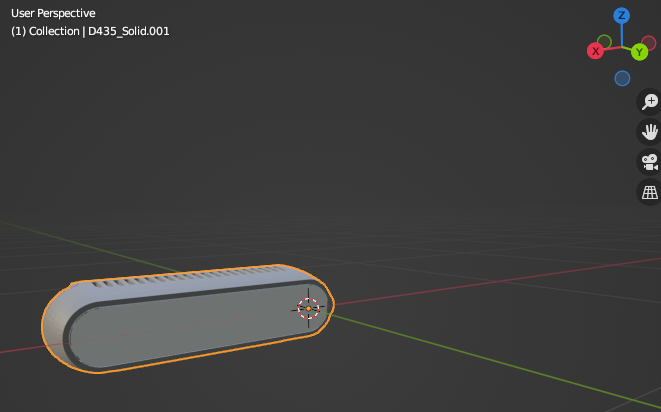
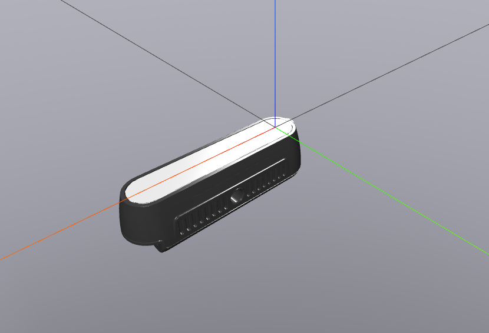

# Modeling camera's

The object meshes of the camera's are retrieved from online sources. We model and orientate the mesh such that eye used
for calibration is the origin of the mesh with **in Blender** this origin being Y+ forward, X+ facing sidewards to the
right and Z+ up. See this example of the Realsense D435i:

Export with Z forward, Y- up, resulting in:

This allows using the camera calibration matrix directly in simulation as mounting point without any manually defined
offset to align the camera.
