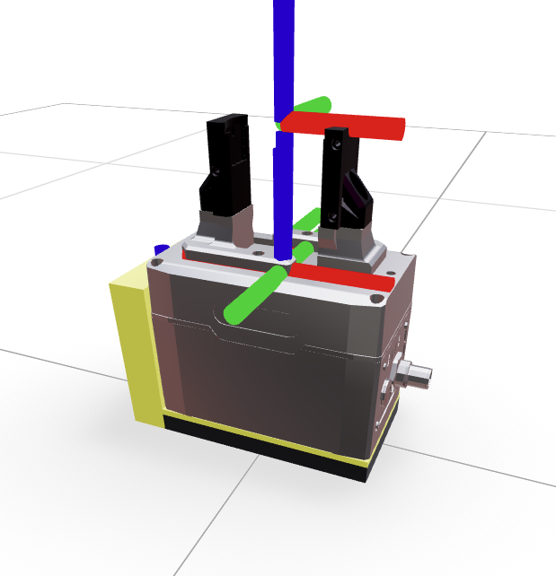

This URDF combines the [Schunk EGK-40-MB](https://schunk.com/be/nl/grijpsystemen/parallelgrijper/egk/egk-40-mb-m-b/p/000000000001491762?csot0=tools&cspt0=tctp&cspc0=productTabComponent&cspt1=tcss&cspc1=product-accessories&cspfp1=000000000001491762) body with the UR-schunk adapater plate, a 3D printed camera/pcb mount that we often use in the lab, custom adapter to provide a mechanical interface to Robotiq-style fingertips, and then custom fingertips with the same size as the default [Robotiq silicone fingertips](https://blog.robotiq.com/hubfs/Fingertips%20%2B%20Accessories/Fingertips_Bundle_EN_2024-11_V8.pdf#page=14.00). This model can hence be used with both the default fingertips and the magneto-fingertips.

A TCP frame was also added,centered between the tips of the fingertips. This TCP Frame has an offset of 154mm from the `baselink`, which has been verified on a real system.

Keep in mind that the gripper is not symmetric, +x axis points to the side of the gripper that has the cable connector.

